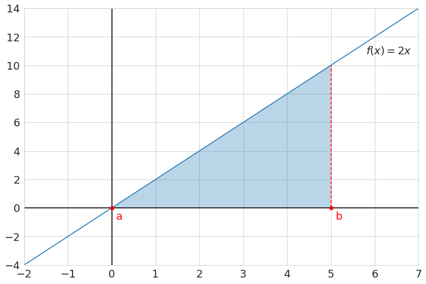
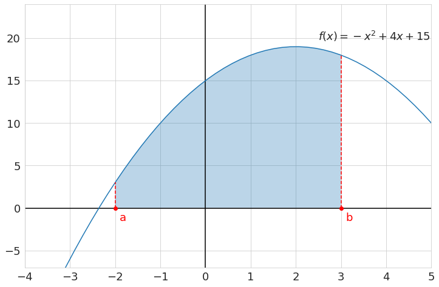
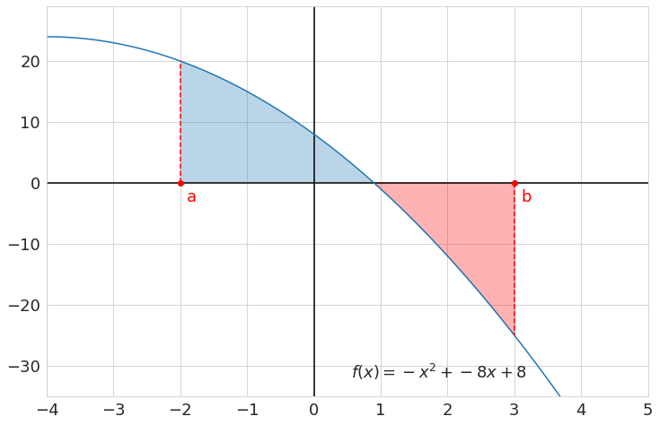
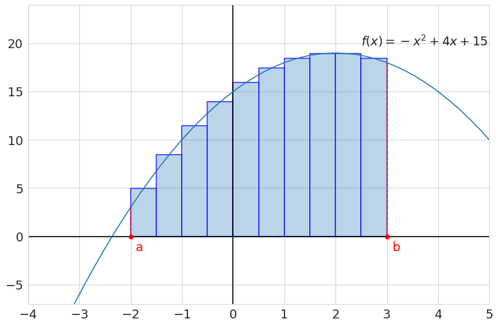

# Riemann sum

*A Riemann sum can be used to approximate the integral of a function using a
finite sum of rectangular areas.*

This page serves simply to introduce the terms and concepts from the sentence
above, some of which you may already be familiar with. The goal is for you to
come away with enough understanding to implement a Riemann sum approximation in
the next assignment. Any topic you don't need an introduction or refesher on,
you can, of course, just skip.

## Integrals

The integral of some function between the points $a$ and $b$ can be interpreted
as the total area between the line of the function and the x-axis, or
informally *the area **under** the curve*, between the points $a$ and $b$.
The simplest example would be to integrate a linear function, like
$$f(x) = 2x$$, between 0 and 5:

{: style="max-width:500px;"}

The area under the curve here can just be calculated by computing the area of
the highlighted triangle, which is easy enough to do, and comes out to $25$.

Formally, this integral would be written as

$$\int_{0}^5 2x~dx = 25$$

where $\int$ is the integral symbol, with the lower bound ($a$) written at the
bottom of the symbol and upper bound ($b$) written at the top. The $dx$
indicates that $x$ is the variable we are integrating over.

However, not every integral is so straightforward to solve. Take, for example,

$$\int_{-2}^3 (-x^2 + 4x + 15)~dx$$

where we can no longer use the area of a triangle to solve the problem.

{: style="max-width:500px;"}

If you've ever taken a calculus course, you will have probably learned how to
analytically solve such integrals *exactly*. This assignment will **not**
about these analytical solutions, but instead letting the computer do the
work to *approximate* an integral. There are quite a few different ways you can
leverage the computational power of a computer to approximate an integral, the
most well known of which is a Riemann sum.

One last important detail on the definition of an integral: Any area *below*
the x-axis, is considered **negative area**, and so subtracts from the
total area, instead of adding to it. Take, for example,

$$\int_{-2}^3 (-x^2 - 8x + 8)~dx$$

{: style="max-width:500px;"}

where all of the area highlighted in red counts as negative area. The total
blue area is approximately $33.05$ and the red area is approximately $-24.72$,
which means the total integral works out to be about $8.33$.

## Riemann sum

A Riemann sum is probably the most common way to **approximate** an integral.
You simply divide the integral into many smaller rectangles, for which you can
easily compute the area, and add all of these areas together to approximate the
original integral.

Consider the integral example from before

$$\int_{-2}^3 (-x^2 + 4x + 15)~dx$$

but now, let's instead approximate it with 10 rectangles of equal width

{: style="max-width:500px;"}

It should be pretty straightforward to see that the sum of all these rectangle
areas will approximate the actual integral. In fact, the more of these equal
width rectangles you use, the better this approximation will be.

For now, let's stick with the simple example of using 10 rectangles. The total
width of the integral is $3 - -2 = 5$, meaning the width of each individual
rectangle should be $\frac{5}{10} = 0.5$. The function we're integrating over
is $$f(x) = -x^2 + 4x + 15$$.

The first rectangle starts at $-2$ and, with a width of $0.5$, ends at $-1.5$.
What would the best value be to use for the height of this first rectangle in
the approximation?  Probably the value of function at the *middle* of the
rectangle, so $f(-1.75)$, which would be $-(-1.75)^2 + 4 \cdot -1.75 + 15 \approx
4.94$. The area of this rectangle can now very easily be computed of course,
using the width of $0.5$, so $4.94 \cdot 0.5 = 2.47$.

This process can be repeated for all 10 rectangles, and summed together to get
the complete approximation. So, a little more formally, we would write

$$\begin{align*}
    \int_{-2}^3 f(x)~dx &\approx \frac{1}{2}f(-1.75) +
        \frac{1}{2}f(-1.25) + \dots + \frac{1}{2}f(2.75) \\
    &\approx \sum_{i=0}^{9} \frac{1}{2}f(-2 +\frac{1}{2}i + \frac{1}{4}) \\
    &\approx 73.4375
\end{align*}$$

where $$\sum$$ is the summation symbol, adding all the different values for the
summation index ($i$), starting from the lower bound ($i=0$) up to and
including the upper bound ($9$).

More generally, if we divide any integral from $a$ to $b$, into $$N$$
rectangles, then the width of each rectangle will be $$\Delta x = \frac{b -
a}{N}$$. The approximation for the integral then becomes

$$\int_{a}^b f(x)~dx \approx \sum_{i=0}^{N-1} \Delta x~ f(a +\Delta x(i +
\frac{1}{2}))$$

which is the midpoint Riemann sum approximation.

The larger value of $N$ you use, the better this approximation will be.
Computing 10 rectangles by hand is already quite tedious, but using the
computer we can compute $10000$ rectangles almost instantly, making the
approximation really accurate.

**Note:** As mentioned at the end of the section on integrals, any area below
the x-axis counts as negative area. One of the nice things about the Riemann
sum approximation, is that this is automatically done correctly, as long as
rectangles under the x-axis are allowed to have a negative height, as this will
result in a negative area for these rectangles.
