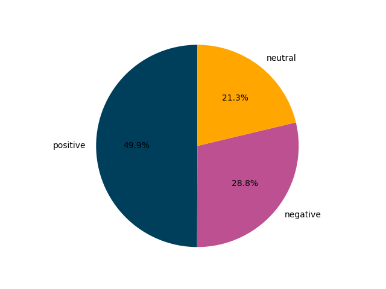

# Summarizing and plotting sentiment

Write a program that reads in a selection of texts, calculates each text's sentiment, and summarizes the results in a pie chart.

## Background

We have provided a [text file](trump.txt) with a selection of tweets from a famously grumpy US president. Can our analysis confirm that he's most often tweeting about what he doesn't like? Let's see.

## Strategy

Your program should comprise three parts:

1. Load the file with tweet on each line. To do this, you need to use this code:

        with open("trump.txt", encoding="utf8") as tweet_file:
            tweets = tweet_file.read().splitlines()

   Your `tweets` variable will then contain a list of strings, each string being the text of a single tweet.

2. Calculate the sentiment of each tweet, keeping track of the number of positive, as well as the negative and neutral tweets. Which loop strategy can you use to do this?

3. Take the calculated numbers and use these to make a nice pie chart: [matplotlib.pyplot.pie — Matplotlib 3.1.0 documentation](https://matplotlib.org/3.1.0/api/_as_gen/matplotlib.pyplot.pie.html#matplotlib.pyplot.pie). The chart should have three parts: positive, negative and neutral. Also make sure the chart has descriptive labels and appropriate colors! Have a look at the Matplotlib docs.

## Testing

This program can't be tested automatically!

Note that your results might differ a bit from the example chart shown above.
