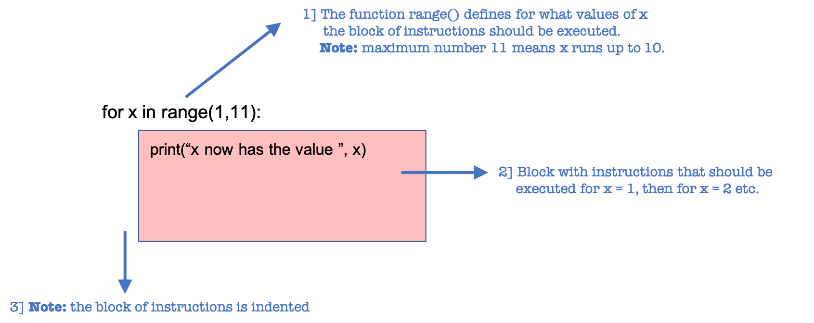

# Loops

In a computer program you often encounter a (small) set of instructions that you want to execute multiple times. They way to do and steer that is by using loops. On this page we discuss the format and features of loops and we will also explore a few examples where loops can be very useful.
 
Please create a file called `practicing_loops.py` and use it to implement the various examples and exercises on this page.

## Loops to repeat instructions

A `for`-loop is used when you want to repeat a set of instructions. For example, if you want to print the numbers from 1 to 10 on the screen you could do that with ten separate print-statements, but you could also use the following construcion:

    for x in range(1, 11):
        print("x now has the value ",x)
    
This program has as output:

    x now has the value 1
    x now has the value 2
    x now has the value 3
    ...
    x now has the value 10

The loop starts by setting the value of x to 1 and then executing *all* instructions in the loop one by one. After that, x is assigned the value 2 and again all instructions are executed. In this simple program there is only a single instruction: print the value of x, but we can of course expand the number of instructions. The most important notion is that the program automatically changes the variable `x`.

{: style="max-width:500px;"}

There are a few important things to note:

-   **Note:** Python counts *up to* the last number in the function range(): range(1,11) runs from *up to and including* 10. This is a very common mistake to make when you begin programming in Python. It might feel unintuitive, but that's just the way it is.

-   In hthe above example we assigned the name 'x' to the variable, but we could of course have used a different name like 'number', 'i', 'counter' etc. You can use whatever you want.

-   With range you can also specify the stepsize. This is standard set to 1, but if you perfer to take steps of 10 you would use the following syntax:
    
         for x in range (1,100, 10):
    
    Please try this yourself to make sure you understand what values x takes in this program. 
	

## Types of loops

In Python, just like in almost every other programming language, there are two different constructions to loop over a variable: the **for-loop** and the **while-loop**. 

A for-loop is used when you know beforehand how often you want to repeat the set of instructions. In cases where you do not know that in advance and want to evaluate at every step if you want to continuer not, you use the while-loop. In a while-loop, just like in the for-loop, all instructions are executed for a specific value of the variable. Ths difference is that each time the variable is changed, there is an evaluation wether or not to re-do the blok again.

In most cases, `for` and `while` are interchangeable. This for-loop:

	    for x in range(100):
	        print("x now has the value ", x)

is equal to the following `while-loop``;

	    x = 0
	    while x < 100:
	        print("x now has the value ", x)
	        x = x + 1

The reason that the `for`-loop is more often used is that it is a bit more compact and also easier readable. However this can only be done is you know beforehand how often this needs to be executed. In other cases, and also with user input it can almost only be done with a while construction.

## Computing things using loops

In the first example we had only a single instruction in the loop itself, 'print the value of x on the screen', but you could have multiple instructions for every value x takes.

In the next example we add the value of x to another variable that we have set to zero at the beginning of the program. At the end of the program this variable contains the sum of the values from 1 to 10. Once we have that, it is easy to get the sum of numbers from 1 to 712643 rather than from 1 to 10 of course.

As soon as all instructions have been executed forthe highest value the variable x can take, the loop is 'finished' and the program continues with all instructions after the for-loop. In this case we have the program print the value of the sum of all numbers. Please pay close attention to the indentation/position of the last line.

    sum = 0 
    for x in range(1, 11):
        print("x now has the value ",x)
        sum = sum + x

    print("The sum of all numbers from ", 1, " to ", 10 = ", sum)

**Exercise 1:** Please change this program by changing the indentation of the print-statement in such a way that it starts at the same position as the line 'sum = sum + x'. Run the program and try to understand what happens. problems with indentation is a very common mistake when using loops, so it is important to see these type of 'mistakes' so you can recognize them later. 

**Exercise 2:** At this moment we use the numbers from 1 to 10. Please try to adapt the program in such a way that you define a new variable once at the beginning of the program (so not in the range() function) that holds the maximum number.

**Exercise 3:** Make a program that has the same functionality as the example, but now use a while-loop instead of a for-loop. 

**Exercise 4:** Use a while-loop to ensure that the program will print numbers greater than 10, but that it will stop if the sum of all numbers up to that point is bigger than 123.

## Filtering using loops

Within the set of instructions you can also use conditionals.

For example, if you want the loop to froun from 1 to 20, but want to only print the nubers that are larger than 15 or numbers if it is divisible by three you could use the following code:

    for number in range(1, 20):
        if number > 15:
		   print("This number is bigger than 15: ", getal)
        if getal % 3:
		   print("This number is exactly divisible by 3: ", getal)

We already mentioned that you can decide on the name of the variable. And as you see, in the above exampe we have changed the name of our variable 'x' to 'number'.

**Exercise:** Try to adapt the above example in such a way that at the end of the loop, the program rints to the screen how many numbers were exactly divisible by 3. To do this you will have to define a so-called 'counter', a variable that is set to zero at the start of the program and that is incremented by 1 every time you encounter a number that is exactly divisible by 3. Also take some time to format the output to the screen and have tyour program print:

    From the numbers 1 to 20 there are ... numbers that are exactly divisible by 3.

## Loops in loops

In the examples we have looked at up to now we have only printed things and saved some variables. Nothing too complex. This is not always the case and loops are often used in more complex constructions.

It is also possible to make loops withing loops, so-called 'nested loops'*. If you for example want to vary a specific variable `y` from 1 to 3 for every value the variable `x` takes (for example when `x` is the student number and `y` is the mark for three different assignments during an exam) you can use the folloing construction:

    for x in range(1, 6):
       for y in range(1, 4):
           print("x = ", x, " and  y = ", y)
		   
This program has as output:

    x = 1,  y = 1 
    x = 1,  y = 2 
    x = 1,  y = 3 
    x = 2,  y = 1 
    ...
    x = 6,  y = 2 
    x = 6,  y = 3 

**Exercise 6:** Adapt the program in such a way that the print-statement is only done if the sum of x and y is more than 6.

**Exercise 7:** Adapt the program in such a way dat the program, at the moment just before a new value is assigned to `x` (i.e. just after the loop over y is finished) the program prints: `the value of x is now ... and we have just finished the loop over y`.
	
**Exercise 8:** Adapt the program in such a way that y does not run from 1 to 4, nut from 1 to the value of x. 

**Exercise 9:** Adapt the program in such a way that y does not run from 1 to 4, nut from 1 to the value of x. Use the while-construction for the values of y.

**Exercise 10:** Adapt the program in such a way that loop over y is only done if x is larger than 3. Keep the statement range(1,6) in teh for-loop of x, but use another solution using a conditional, an if-statement.

## Practice and  debugging

If you meet a for-loop somehwere in this course that you don;t understand very well, eithe rin the examples we give or in your own code, please come back to this page and read it again. Last tip: you can always use print-statements to verify if the loops are really doing what you think you have told them to do. 
